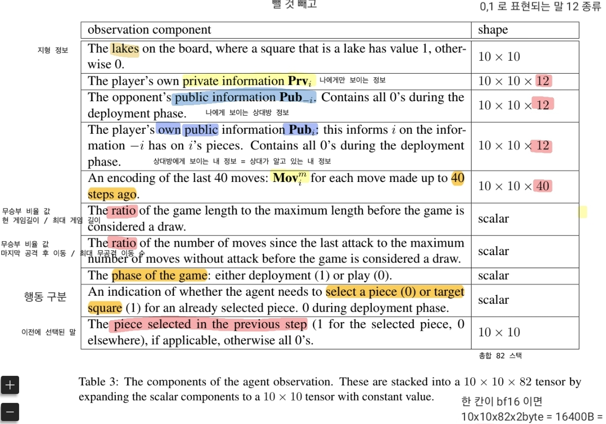

    

| index | 정보 | 채널 깊이 | D type |
| :---: | :---: | :---: | :---: |
| 0 | 지형정보  [이동가능, 이동불가, 숲] | 3 | one-hot |                      
| 1 | P's own private info P에게만 보이는 자기말 정보  | 병종수 | one-hot |
| 2 | Op's public info  P에게 보이는 Op's 말 정보  | 병종수 | one-hot |
| 3 | P's own public info  Op 에게 보이는 P's 말 정보 | 병종수 | one-hot |
| 4 | last move | 움직임수 | ? |
| 5 | 무승부까지, 보급품남음수로할까 보급품 떨어지면 약해지는 걸로 | 플레이어수 | float |
| 6 |   | ? |
| 7 |   | ? |
